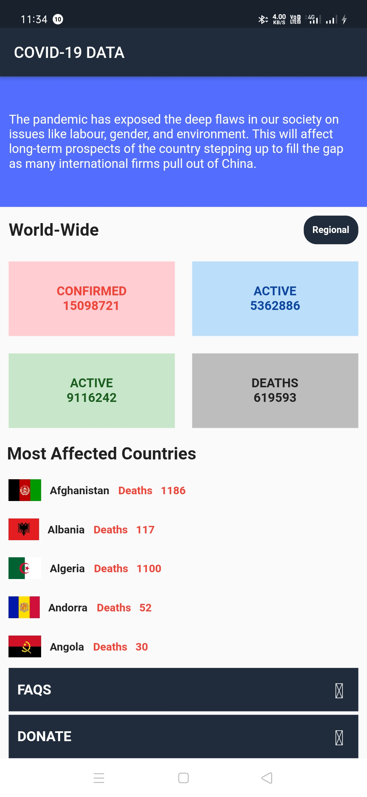

# CoronaVirus Tracker Application using Flutter.

Keep you updated about coronavirus cases around world.

## Details
-Technology Used - Flutter.
-Language Used - Dart.
This application uses API to access data from web and then convert it to JSON to present necessary information.

## Screenshot of Project

For help getting started with Flutter, view our
[online documentation](https://flutter.dev/docs), which offers tutorials,
samples, guidance on mobile development, and a full API reference.
